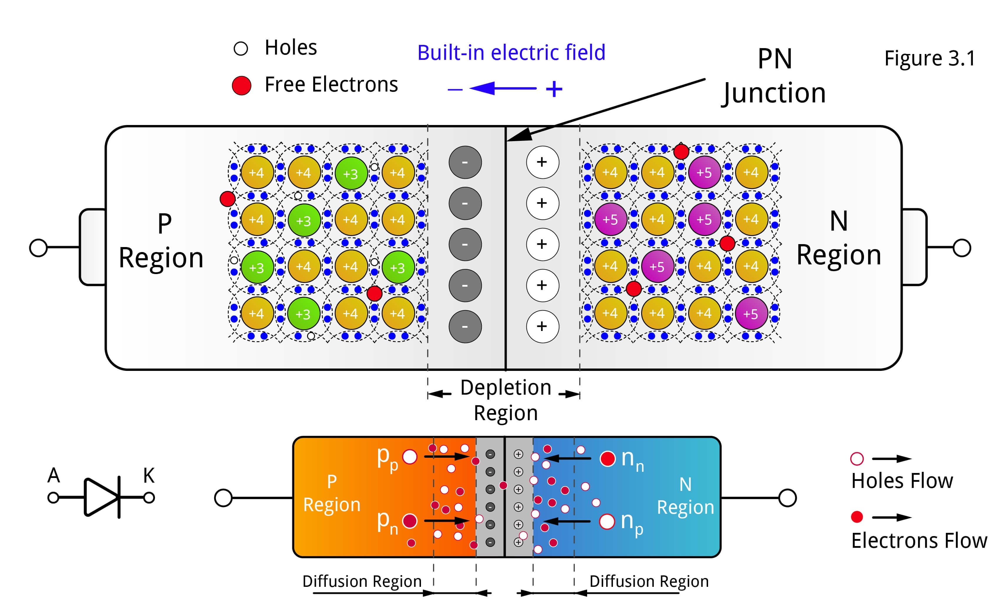

## Procedure

  
**Fig. 1.  Basic Structure of PN Junction**

  
Materials Required
------------------

*   pn Junction Diode
*   Power Supply
*   Multimeter
*   Connecting Wires

Procedure
---------

1.  **Setup the Circuit:**
    *   Connect the pn junction diode in the circuit with the power supply and multimeter as shown in the diagram.
    *   Ensure the connections are secure and correct.
2.  **Set Initial Parameters:**
    *   Set the acceptor concentration in the p-region ($$N_A$$) to a desired value (e.g., 1e15 /cm^3).
    *   Set the donor concentration in the n-region ($$N_D$$) to a desired value (e.g., 1e15 /cm^3).
    *   Adjust the applied voltage (V) to a specific value (e.g., -0.5 V).
    *   Set the temperature (T) to a specific value (e.g., 300 K).
3.  **Apply the Parameters:**
    *   Turn on the power supply and apply the set parameters to the circuit.
    *   If using simulation software, enter the parameters into the simulation tool and run the simulation.
4.  **Record the Data:**
    *   Observe and record the following characteristics:
        *   **Band Diagram:** Note the energy bands across the pn junction.
        *   **Current-Voltage Characteristics:** Measure and plot the I-V curve of the diode.
        *   **Charge Density:** Determine the charge distribution across the junction.
        *   **Electric Field:** Measure the electric field intensity in the depletion region.
        *   **Carrier Densities:** Measure the concentration of electrons and holes.
        *   **log(Carrier Densities):** Plot a logarithmic view of the carrier concentrations.
5.  **Analyze the Data:**
    *   Use the recorded data to analyze the electrical properties of the pn junction:
        *   Calculate the **Depletion Width (W)** using the charge density profile.
        *   Determine the **Built-in Potential ($$V_{bi}$$)** from the band diagram.
        *   Examine the **Electric Field (E)** distribution within the depletion region.
        *   Compare the carrier densities inside and outside the depletion region.
6.  **Conclude the Experiment:**
    *   Summarize the findings and compare them with theoretical expectations.
    *   Discuss any discrepancies and possible sources of error.
