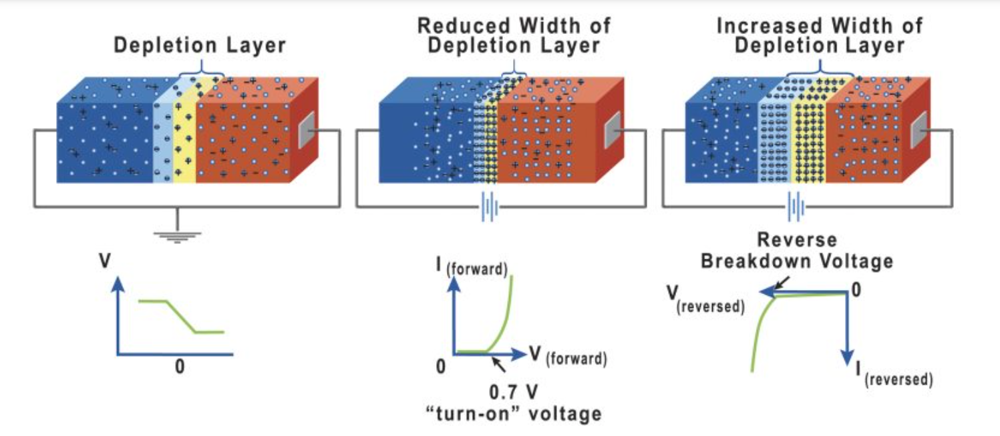

## Theory
**Introduction:**  
A pn junction is formed when p-type and n-type semiconductor materials are brought together, creating a junction with distinct electrical properties. In the depletion mode, the junction is characterized by a region where the charge carriers are depleted, and the primary focus is on the behavior of the junction when no external bias is applied.

1\. Depletion Region
--------------------

The depletion region is a key feature of the pn junction in depletion mode. It forms around the junction where the p-type and n-type materials meet. In this region, the majority charge carriers (holes in the p-type and electrons in the n-type) recombine, leaving behind a region with fixed, ionized dopant atoms. This region is devoid of free charge carriers and is characterized by an electric field that opposes further diffusion of carriers.

2\. Band Bending
----------------

Band bending occurs in the depletion region due to the built-in electric field. The energy bands (conduction and valence bands) curve near the junction interface, reflecting the potential difference across the junction. This bending indicates the work function difference between the p-type and n-type regions and determines the barrier height that carriers must overcome to move across the junction.

3\. Electric Field and Potential Distribution
---------------------------------------------

The electric field within the depletion region is directed from the n-type to the p-type side. It results from the separation of positive and negative charges left behind after recombination. This field creates a potential difference known as the built-in potential, which can be calculated using Poisson's equation and the charge density distribution in the depletion region.

4\. Charge Carrier Concentrations
---------------------------------

Outside the depletion region, the charge carrier concentrations are equal to the doping levels of the p-type and n-type materials. In the p-type region, the carrier concentration is approximately the acceptor concentration ($$N_A$$), while in the n-type region, it is approximately the donor concentration ($$N_D$$).

5\. Depletion Width
-------------------

The depletion width,$$W$$, is the distance over which the electric field extends in the depletion region. It can be determined from the charge density and the built-in potential. The width varies with the doping concentrations of the p-type and n-type materials and affects the junction's electrical characteristics.

6\. Electrical Characteristics
------------------------------

In depletion mode, the pn junction is electrically neutral outside the depletion region. The depletion approximation simplifies the analysis by assuming constant doping levels outside the depletion region and a fixed depletion width. Key electrical characteristics that can be derived include:

*   **Built-in Potential:** The voltage across the junction created by the charge separation in the depletion region.
*   **Electric Field:** The intensity of the field within the depletion region, which influences carrier movement and junction behavior.
*   **Carrier Concentration Profiles:** The distribution of electrons and holes within the depletion region.
*   **Depletion Width:** The extent of the depletion region, which is a function of doping levels and built-in potential.

Understanding these electrical properties is essential for analyzing and designing semiconductor devices that utilize pn junctions, such as diodes, transistors, and photovoltaic cells. 

**Fig. 1. Threshold Voltage and Inversion charge**

  

In an abrupt pn junction, the doping concentration changes abruptly from p-type to n-type, creating a well-defined interface between the two regions. This sharp transition is idealized for analytical solutions. To understand the electrical behavior of this junction, key properties are often analyzed within the context of the depletion approximation.

In the depletion approximation, the region around the pn junction where the doping changes is called the depletion region. Within this region, it is assumed that the majority carriers (holes in the p-type region and electrons in the n-type region) have diffused away, leaving behind a region depleted of free charge carriers. The depletion region is characterized by a width _W_, where the charge carrier densities are very low and the primary contributors to the electric field are the fixed ionized donor and acceptor atoms.

Outside the depletion region, the charge carrier densities are assumed to be equal to the doping concentrations of the respective regions. In the p-type region, the carrier density is approximately equal to the acceptor concentration ($$N_A$$), while in the n-type region, it is approximately equal to the donor concentration ($$N_D$$).

Due to charge neutrality outside the depletion region, the semiconductor as a whole remains electrically neutral. The charge density distribution in the depletion region can be derived from Poisson's equation and is essential for understanding the junction's electrical properties.

To calculate the characteristics of the pn junction using the depletion approximation, the following properties are commonly determined:

*   **Band Bending:** The change in the energy bands across the junction due to the built-in electric field. This bending reflects the work required to move a charge from one side of the junction to the other.
*   **Local Electric Field:** The electric field within the depletion region that results from the separation of charges. This field influences carrier motion and is crucial for understanding junction behavior under various biasing conditions.
*   **Carrier Concentration Profiles:** The distribution of electron and hole concentrations throughout the junction, which shows how these concentrations vary from the center of the depletion region to the edges.
*   **Local Conductivity:** The ability of the semiconductor to conduct electric current, which is affected by the carrier concentrations and their mobility within different regions of the junction.

Using the depletion approximation allows for simplification of these calculations by assuming a fixed depletion width and constant carrier concentrations outside this region. The charge density distribution for an abrupt junction, which reflects the variation of charge density within the depletion region, can be calculated to provide a detailed picture of the junction's electrical characteristics.

$$ρ(x)= \\begin{cases} 0 & \\mbox{for } x\\lt x\_p, \\\\ -eN\_A & \\mbox{for } x\_p\\lt x\\lt 0, \\\\ eN\_D & \\mbox{for } 0 \\lt x\\lt x\_n, \\\\ 0 & \\mbox{for } x\_n\\lt x.\\end{cases}$$

The charge density can be integrated to determine the electric field $$E = \int\frac{\rho}{\epsilon}dx$$ ,

$$E(x) = \\begin{cases} 0 & \\mbox{for } x\\lt x\_p, \\\\ -\\frac{eN\_A}{\\epsilon}(x-x\_p) & \\mbox{for } x\_p\\lt x\\lt 0, \\\\ \\frac{eN\_D}{\\epsilon}(x-x\_n) & \\mbox{for } 0 \\lt x\\lt x\_n, \\\\ 0 & \\mbox{for } x\_n\\lt x.\\end{cases}$$

At the transition from p-doped to n-doped at x\=0x\=0x=0, there is a maximum in the electric field, $$E = \frac{eN_Ax_p}{\epsilon} = -\frac{eN_Dx_n}{\epsilon}.$$ Due to the charge neutrality condition, $$|N_Ax_p|=|N_Dx_n|.$$ Further $$x_p < 0 < x_n$$ so the electric field is pointed in the negative x-direction, from n towards p. The electric field can be integrated to determine the electrostatic potential $$ϕ=-\int E dx$$ ,

$$ϕ(x)= \\begin{cases} -\\frac{eN\_Ax\_p^2}{2\\epsilon} & \\mbox{for } x\\lt x\_p, \\\\ \\frac{eN\_A}{\\epsilon}\\left(\\frac{x^2}{2}-x\_px\\right) & \\mbox{for } x\_p\\lt x\\lt 0, \\\\ -\\frac{eN\_D}{\\epsilon}\\left(\\frac{x^2}{2}-x\_nx\\right) & \\mbox{for } 0 \\lt x\\lt x\_n, \\\\ \\frac{eN\_Dx\_n^2}{\\epsilon} & \\mbox{for } x\_n\\lt x.\\end{cases}$$

The voltage across the junction is the difference in the electrostatic potential $$)V_{bi} - V=\phi (x_n)-\phi(x_p),$$

$$V_{bi} - V= \frac{eN_D x_n^2}{2 \epsilon} + \frac{eN_A x_p^2}{2 \epsilon},$$

where $$V\_{bi}$$ is the built-in voltage. Using the charge neutrality condition $$\\left( N_A|x_p|=N_D|x_n|=N_A (W-|x_n|)=N_D (W-|x_p|) \\right),$$ expressions for $$|x_p|$$ and $$|x\_n|$$ can be obtained,

$$|x_p| = \frac{N_DW}{N_A+N_D}, \\\\ |x_n| = \frac{N_AW}{N_A+N_D}.$$

Substituting these expressions into the formula for $$V_{bi}$$ - V and solving for $$W$$ yields,

$$W= \sqrt{\frac{2\epsilon(N_D+N_A)(V_{bi}-V)}{eN_DN_A}}.$$
$$\\vec{j}\_{n,\\text{drift}}= ne\\mu\_n\\vec{E},  \\vec{j}\_{p,\\text{drift}}= pe\\mu\_p\\vec{E}, $$ 
$$\\vec{j}\_{n,\\text{diffusion}}= eD\_n\\frac{dn}{dx}, \ and \ \\vec{j}\_{p,\\text{diffusion}}= -eD\_p\\frac{dp}{dx}$$
 
     
 
